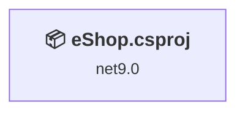
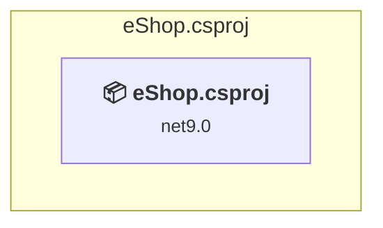

# Projects and dependencies analysis

This document provides a comprehensive overview of the projects and their dependencies in the context of upgrading to .NET 9.0.

## Table of Contents

- [Projects Relationship Graph](#projects-relationship-graph)
- [Project Details](#project-details)

  - [eShop.csproj](#eshopcsproj)
- [Aggregate NuGet packages details](#aggregate-nuget-packages-details)

## Projects Relationship Graph

Legend:
📦 SDK-style project
⚙️ Classic project

## Project Details

### eShop.csproj

#### Project Info

- **Current Target Framework:** net9.0
- **Proposed Target Framework:** net10.0
- **SDK-style**: True
- **Project Kind:** AspNetCore
- **Dependencies**: 0
- **Dependants**: 0
- **Number of Files**: 83
- **Lines of Code**: 3817

#### Dependency Graph

Legend:
📦 SDK-style project
⚙️ Classic project

#### Project Package References

| Package | Type | Current Version | Suggested Version | Description |
| :--- | :---: | :---: | :---: | :--- |
| Azure.AI.OpenAI | Explicit | 2.1.0 |  | ✅Compatible |
| Azure.Identity | Explicit | 1.13.2 |  | ⚠️NuGet package is deprecated |
| Microsoft.ApplicationInsights.AspNetCore | Explicit | 2.23.0 |  | ✅Compatible |
| Microsoft.AspNetCore.Diagnostics.EntityFrameworkCore | Explicit | 9.0.4 | 10.0.0 | NuGet package upgrade is recommended |
| Microsoft.AspNetCore.Identity.EntityFrameworkCore | Explicit | 9.0.4 | 10.0.0 | NuGet package upgrade is recommended |
| Microsoft.AspNetCore.Identity.UI | Explicit | 9.0.4 | 10.0.0 | NuGet package upgrade is recommended |
| Microsoft.AspNetCore.OutputCaching.StackExchangeRedis | Explicit | 9.0.4 | 10.0.0 | NuGet package upgrade is recommended |
| Microsoft.Azure.StackExchangeRedis | Explicit | 3.2.1 |  | ✅Compatible |
| Microsoft.Data.SqlClient | Explicit | 6.0.2 |  | ✅Compatible |
| Microsoft.EntityFrameworkCore.SqlServer | Explicit | 9.0.4 | 10.0.0 | NuGet package upgrade is recommended |
| Microsoft.EntityFrameworkCore.Tools | Explicit | 9.0.4 | 10.0.0 | NuGet package upgrade is recommended |
| Microsoft.Extensions.Caching.Hybrid | Explicit | 9.4.0 |  | ✅Compatible |
| Microsoft.Extensions.Caching.Memory | Explicit | 9.0.4 | 10.0.0 | NuGet package upgrade is recommended |
| Microsoft.Extensions.Caching.StackExchangeRedis | Explicit | 9.0.2 | 10.0.0 | NuGet package upgrade is recommended |
| Microsoft.VisualStudio.Web.CodeGeneration.Design | Explicit | 9.0.0 | 10.0.0-rc.1.25458.5 | NuGet package upgrade is recommended |
| NRedisStack | Explicit | 1.0.0 |  | ✅Compatible |
| System.Formats.Asn1 | Explicit | 9.0.4 | 10.0.0 | NuGet package upgrade is recommended |
| System.Linq.Async | Explicit | 6.0.1 |  | ✅Compatible |
| System.Text.Json | Explicit | 9.0.4 | 10.0.0 | NuGet package upgrade is recommended |

## Aggregate NuGet packages details

| Package | Current Version | Suggested Version | Projects | Description |
| :--- | :---: | :---: | :--- | :--- |
| Azure.AI.OpenAI | 2.1.0 |  | [eShop.csproj](#eshopcsproj) | ✅Compatible |
| Azure.Identity | 1.13.2 |  | [eShop.csproj](#eshopcsproj) | ⚠️NuGet package is deprecated |
| Microsoft.ApplicationInsights.AspNetCore | 2.23.0 |  | [eShop.csproj](#eshopcsproj) | ✅Compatible |
| Microsoft.AspNetCore.Diagnostics.EntityFrameworkCore | 9.0.4 | 10.0.0 | [eShop.csproj](#eshopcsproj) | NuGet package upgrade is recommended |
| Microsoft.AspNetCore.Identity.EntityFrameworkCore | 9.0.4 | 10.0.0 | [eShop.csproj](#eshopcsproj) | NuGet package upgrade is recommended |
| Microsoft.AspNetCore.Identity.UI | 9.0.4 | 10.0.0 | [eShop.csproj](#eshopcsproj) | NuGet package upgrade is recommended |
| Microsoft.AspNetCore.OutputCaching.StackExchangeRedis | 9.0.4 | 10.0.0 | [eShop.csproj](#eshopcsproj) | NuGet package upgrade is recommended |
| Microsoft.Azure.StackExchangeRedis | 3.2.1 |  | [eShop.csproj](#eshopcsproj) | ✅Compatible |
| Microsoft.Data.SqlClient | 6.0.2 |  | [eShop.csproj](#eshopcsproj) | ✅Compatible |
| Microsoft.EntityFrameworkCore.SqlServer | 9.0.4 | 10.0.0 | [eShop.csproj](#eshopcsproj) | NuGet package upgrade is recommended |
| Microsoft.EntityFrameworkCore.Tools | 9.0.4 | 10.0.0 | [eShop.csproj](#eshopcsproj) | NuGet package upgrade is recommended |
| Microsoft.Extensions.Caching.Hybrid | 9.4.0 |  | [eShop.csproj](#eshopcsproj) | ✅Compatible |
| Microsoft.Extensions.Caching.Memory | 9.0.4 | 10.0.0 | [eShop.csproj](#eshopcsproj) | NuGet package upgrade is recommended |
| Microsoft.Extensions.Caching.StackExchangeRedis | 9.0.2 | 10.0.0 | [eShop.csproj](#eshopcsproj) | NuGet package upgrade is recommended |
| Microsoft.VisualStudio.Web.CodeGeneration.Design | 9.0.0 | 10.0.0-rc.1.25458.5 | [eShop.csproj](#eshopcsproj) | NuGet package upgrade is recommended |
| NRedisStack | 1.0.0 |  | [eShop.csproj](#eshopcsproj) | ✅Compatible |
| System.Formats.Asn1 | 9.0.4 | 10.0.0 | [eShop.csproj](#eshopcsproj) | NuGet package upgrade is recommended |
| System.Linq.Async | 6.0.1 |  | [eShop.csproj](#eshopcsproj) | ✅Compatible |
| System.Text.Json | 9.0.4 | 10.0.0 | [eShop.csproj](#eshopcsproj) | NuGet package upgrade is recommended |

